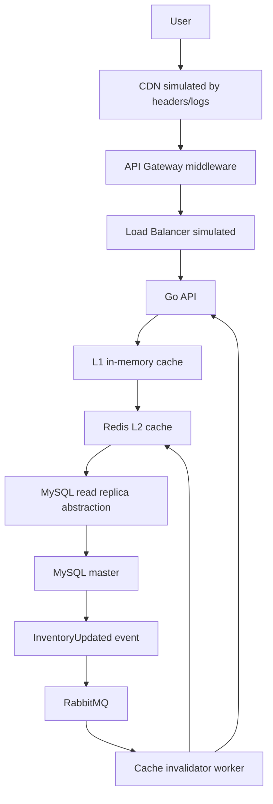

# inventory-cache-lab

A small Go backend that demonstrates a Myntra-style inventory caching architecture.

This is not a Myntra clone. It is a local lab for the read/write pattern behind high-traffic inventory systems: hot reads go through a fast process-local cache and Redis before touching MySQL, while checkout writes stay strict and use a database row lock to avoid overselling.

## What It Demonstrates

The main idea is that product inventory is read very frequently, especially around sale events. The read path uses a fast L1 near cache and a shared L2 cache before falling back to MySQL. The write path goes through a row-level lock on MySQL, commits the change, then publishes an event that invalidates cache.



## Real Infrastructure vs Local Simulation

| Real system | This project |
| --- | --- |
| CDN | response headers and request logs |
| API Gateway | Go middleware |
| Load Balancer | Docker Compose can add replicas later |
| L1 near cache | in-memory Go cache with TTL |
| L2 distributed cache | Redis |
| MySQL master | MySQL container |
| MySQL read replica | same MySQL container behind a read repository |
| Binlog CDC | app-published event after commit |
| Inventory events | RabbitMQ |
| Cache invalidator | Go worker |

## Inventory Read Path

`GET /inventory/{productID}` checks:

1. L1 in-process cache
2. Redis L2 cache
3. MySQL read repository
4. refill Redis
5. refill L1

The response includes `cache_source` and `request_path` so you can see where the data came from.

## Checkout Write Path

`POST /checkout` does not trust cache. It opens a MySQL transaction, locks the inventory row with `SELECT ... FOR UPDATE`, checks stock, updates inventory, inserts an order, commits, and only then publishes `InventoryUpdatedEvent`.

That boring row lock is the important part: it stops two buyers from taking the same last item.

## Cache Invalidation

The worker consumes RabbitMQ messages from `inventory.cache_invalidator`. For each inventory update it deletes the Redis key and calls the API invalidation endpoint to clear L1 in this single-instance demo.

In a larger deployment, every API instance has its own L1 cache. A production setup would broadcast invalidation to all API instances, use Redis Pub/Sub, keep very short L1 TTLs, or route invalidation through sidecars.

## Run Locally

```bash
docker compose up --build
```

If your Docker install uses the older standalone Compose binary, run:

```bash
docker-compose up --build
```

RabbitMQ management UI is available at:

```text
http://localhost:15672
```

Default login:

```text
guest / guest
```

## Demo Flow

Reset demo data:

```bash
curl -X POST http://localhost:8080/debug/reset
```

First inventory read should hit DB:

```bash
curl http://localhost:8080/inventory/101
```

Expected shape:

```json
{
  "product_id": 101,
  "available_qty": 25,
  "reserved_qty": 3,
  "cache_source": "db",
  "request_path": ["api", "l1_miss", "l2_miss", "mysql_read_replica", "fill_l2", "fill_l1"]
}
```

Second read should hit L1:

```bash
curl http://localhost:8080/inventory/101
```

Expected shape:

```json
{
  "cache_source": "l1",
  "request_path": ["api", "l1_cache"]
}
```

Checkout:

```bash
curl -X POST http://localhost:8080/checkout \
  -H "Content-Type: application/json" \
  -d '{"user_id":1,"product_id":101,"quantity":2}'
```

Expected shape:

```json
{
  "order_id": 9001,
  "product_id": 101,
  "quantity": 2,
  "status": "confirmed"
}
```

Worker logs should show:

```text
inventory_event_received product_id=101
cache_invalidated key=inventory:101
```

Read again:

```bash
curl http://localhost:8080/inventory/101
```

The cache was invalidated, so the next read should come from DB and refill cache.

## Other API Examples

```bash
curl http://localhost:8080/health
curl http://localhost:8080/products/101
curl http://localhost:8080/debug/cache/stats
curl -X POST http://localhost:8080/inventory/101/invalidate
```

## Make Commands

```bash
make docker-up
make docker-down
make test
make load-read
make load-checkout
```

For local non-Docker runs, export `MYSQL_DSN`, `REDIS_ADDR`, and `RABBITMQ_URL`, then run:

```bash
make run
make worker
```

## What To Improve Next

- Redis Pub/Sub for broadcasting L1 invalidation to multiple API replicas
- Separate MySQL read-replica container
- Debezium for real CDC instead of app-published events
- Prometheus metrics and Grafana dashboard
- Rate limiting middleware
- ETag support
- Docker Compose scaling with multiple API replicas
- k6 load tests with graphs
